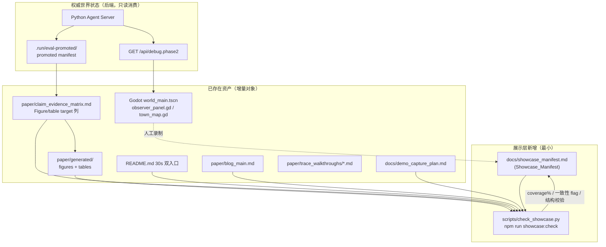

# Design Document — Presentation Showcase（展示层）

## Overview

本设计为 Loomstead `P_demo.exit` 求职展示线的展示层（Presentation Showcase）提供增量实现方案。展示层的本质是**收口 + 补缺 + 一致性追踪**，服务于三个目标维度：可观看（Watchable）、可解释（Explainable）、可传播（Shareable）。

设计的核心立场是**基于现状增量，绝不重造**：

- 录屏脚本、shot list、启动命令、caption stack、人工验收清单已存在于 `docs/demo_capture_plan.md`。
- README 30 秒双入口、`paper/blog_main.md` 技术博客主文、`paper/trace_walkthroughs/figure3_trace_walkthrough_pf_branna_seed01.md` 已落地。
- 3 个 Figure（system_overview / motivational_delegation_loop / trace_evidence_chain_figure3）与多个 Table 已渲染至 `paper/generated/`。
- Observer Dock（`clients/godot/scripts/ui/observer_panel.gd`）已实现三 Tab、trace 过滤、Prev/Next、Copy trace JSON、来源跳转、NPC 高亮。

因此本设计**新增的工程实体极少**，主要是三类：

1. **Showcase_Manifest**——一份新的自管理层追踪文档（`docs/showcase_manifest.md`），追踪 5 条 `P_demo.exit` exit criteria 状态与人工待办。
2. **一个命令化校验脚本**（`scripts/check_showcase.py` + npm `showcase:check`），复用现有 `check_research_evidence.py` / `check_paper_tooling.py` 的 JSON 报告模式，统一完成「口径一致性校验（R10）」「Figure/Table 覆盖率（R6）」「Showcase_Manifest 结构校验（R11）」三件事。
3. **Observer Dock 的边界行为增量**——只改 `observer_panel.gd` / `town_map.gd` 中的少数常量与函数，补齐 R4 的 50 条上限/排序、Copy 反馈 ≥2 秒、loading vs placeholder 区分、同步失败指示。

设计严格区分**自动化可交付**（代码/脚本/文档，可进离线门禁）与**人工 Manual_Verification_Gate**（真实视频/GIF/截图/真实 Godot 窗口复验/玩家手感），后者只产出操作脚本并在 Showcase_Manifest 标 pending，绝不冒充已完成。

### 设计决策摘要

| 决策 | 选择 | 理由 |
| --- | --- | --- |
| Showcase_Manifest 载体 | 自管理层 Markdown（`docs/showcase_manifest.md`）+ 内嵌结构化区块 | 治理 §2.3 允许自主更新；展示层追踪属于"当前事实"，不是 eval artifact，不放 `paper/` 或 `.run/` |
| 一致性 / 覆盖率校验 | 单个新脚本 `scripts/check_showcase.py`，三合一子检查 | 复用现有 check 脚本模式，避免治理 §3.2 禁止的"无 trigger 多脚本加固" |
| 覆盖率数据源 | 解析 `paper/claim_evidence_matrix.md` 的「Figure / table target」列 + 扫描 `paper/generated/` | 矩阵是 claim 的权威来源，渲染产物是事实 |
| Observer Dock | 增量改 `observer_panel.gd` / `town_map.gd` | 面板主体已实现，只补 R4 新增的边界行为 |
| 视频 / GIF / 截图 | 不自动生成，标 Manual_Verification_Gate | 真实 Godot 窗口属人工验收（治理 §3.3） |

## Architecture

### 展示层组件全景

展示层不引入新的运行时服务，它是一组**追踪 + 校验 + 增量呈现**的薄层，叠加在已有 Godot 客户端、paper 工具链与 docs 自管理层之上。

### 数据流与边界

1. **只读消费链**：Godot Observer Dock 只读 `GET /api/debug.phase2`，Figure/Table 只读 `.run/eval-promoted/` promoted manifest。展示层不写回权威世界状态（治理硬约束 + R3）。
2. **校验链**：`check_showcase.py` 读取 claim matrix、`paper/generated/`、README/blog/caption/manifest 文本，产出 JSON 报告（coverage 百分比、一致性 flag、Showcase_Manifest 结构错误）。
3. **追踪回填链**：校验结果由人工/脚本回填进 Showcase_Manifest 的对应字段（命令产出 → 文档事实）。
4. **人工边界**：视频/GIF/截图/真实窗口复验由操作者按 capture plan 执行，结果手动标进 Showcase_Manifest 的 Manual_Verification_Gate 区块。

### 与现有资产的关系（增量映射）

| 需求 | 现有资产 | 增量动作 | 类型 |
| --- | --- | --- | --- |
| R1 Demo 录屏 | `docs/demo_capture_plan.md` 已有 shot list/命令/caption | 补 caption ≥3s 与 duration 20–60s 的显式判据说明；最终视频标 pending | 文档增量 + 人工 gate |
| R2 Godot 窗口复验 | capture plan 已有 manual checklist；客户端已加载 `world_main.tscn` | 补 R2.4/R2.5 连接失败指示设计；窗口复验标 Manual_Verification_Gate | 代码增量 + 人工 gate |
| R3 表现层边界 | 现有 api_client/world_sync 只读 + tool action | 校验脚本检查新 Debug/schema 字段是否有数据契约 | 校验增量 |
| R4 Observer Dock | `observer_panel.gd` 三 Tab 主体已实现 | 补 50 条上限/排序、Copy ≥2s、loading/placeholder 区分、同步失败指示、Prev/Next clamp+indicator | 代码增量 |
| R5 Trace_Walkthrough | `figure3_trace_walkthrough_pf_branna_seed01.md` 已存在 | 校验其引用 promoted artifact 与反事实段落齐全 | 校验增量（已基本满足） |
| R6 Figure/Table 覆盖 | `paper/generated/` 已渲染 3 图 + 多表 | 覆盖率计算脚本 + pending 原因回填 | 校验增量 |
| R7 README 双入口 | README 顶部双入口已落地 | 校验双入口存在 + C2/C3/C4 caveat 口径 | 校验增量（已基本满足） |
| R8 技术博客 | `paper/blog_main.md` 已覆盖 framing/MD/PF | 校验图链接 + promoted run 引用 + caveat + open items | 校验增量（已基本满足） |
| R9 GIF/截图集 | capture plan 提供录制布局 | 标 Manual_Verification_Gate；caption 口径校验 | 人工 gate |
| R10 口径一致性 | README 已用 promoted-with-caveat | 一致性校验脚本扫描所有 showcase material | 校验增量 |
| R11 收口追踪 | 无 | 新建 Showcase_Manifest + 结构校验 | 文档新增 + 校验增量 |

## Components and Interfaces

### C1. Showcase_Manifest（`docs/showcase_manifest.md`）

载体决策：**自管理层 Markdown 文档**，不是脚本生成的 `.run/` artifact，也不放 `paper/`。理由：

- 展示层收口状态是"当前事实 + 人工待办"，符合治理 §2.3 自管理层定位（软上限 250 行、不写历史流水）。
- 它需要同时被人类阅读（主人审核 ready 状态）和被脚本结构校验，Markdown + 约定区块同时满足。
- 它**不是** eval 证据，不应进入 `.run/eval-promoted/` 的 promote/drift 体系（避免治理 §3.2 的基础设施误加固）。

文档结构（机器可解析约定）：

- 一个 `## Exit Criteria Status` 表，5 行对应 5 条 `P_demo.exit` exit criteria，列：`exit_id | title | status | verification_state | blocking_reason`。
- 一个 `## Deliverables` 表，每个可交付物一行，列：`deliverable_id | requirement | verification_state | manual_gate | notes`。
- 一个 `## Figure/Table Coverage` 区块，由 `showcase:check` 写入：`coverage_percent`、`rendered_count / total_count`、pending 列表（每项含 target 名称与 blocking reason）。
- 一个 `## Consistency` 区块，记录 C2/C3/C4 口径一致性最近一次校验结论（compliant / non-compliant + 违规材料列表）。
- 一个 `## Readiness` 单行结论：当 5 条 exit criteria 全部非 pending 时报 `ready for owner review`。

校验态枚举（5 种，与 R11.2 一一对应，复用 `AGENTS.md` §6 既有口径）：`code integrated` / `command checked` / `artifact backed` / `manual verified` / `manual unverified`。

### C2. Showcase 校验脚本（`scripts/check_showcase.py`，npm `showcase:check`）

单脚本三合一，输出 JSON 报告（沿用 `check_research_evidence.py` 的 `{ok, check, errors, warnings, ...}` 结构）。三个子检查：

#### C2.1 口径一致性校验（R10）

- **输入**：showcase material 文本集合——README.md、`paper/blog_main.md`、`docs/demo_capture_plan.md`、`docs/showcase_manifest.md`（caption 文本内嵌于 capture plan / manifest）。
- **规则**：扫描每个文件中出现 `C2`/`C3`/`C4` 的语句行；该行若声明 claim 状态，必须包含 promoted-with-caveat 措辞（匹配 `promoted with caveat` / `promoted-with-caveat`，大小写不敏感、连字符与空格等价）。
- **超限判定**：若某行使用了高于 owner-confirmed 级别的措辞（维护一个禁用短语列表，如 `proven` / `confirmed empirically` / `fully validated` 紧邻 C2/C3/C4），flag 为 `non-compliant` 并记录文件+行号。
- **输出**：`consistency.compliant`（bool）、`consistency.violations`（文件+行+原因列表）。
- **轻量原则**：纯文本扫描，无需解析 Markdown AST；禁用短语列表内联在脚本常量，便于主人调整。

#### C2.2 Figure/Table 覆盖率（R6）

- **解析目标**：读取 `paper/claim_evidence_matrix.md`，解析「Figure / table target」列。
- **目标归一化**：把该列文本拆为离散 target token（如 `Figure 1`、`Table 2`、`Figure 4`、`Table 6`、`Limitations box`）。非图表目标（如 `Workflow`、`Limitations box`、`Regression guardrail note`）标为 `non-renderable`，**排除出分母**，只对真正的 Figure N / Table N 计算覆盖率。
- **「已渲染」判定**：
  - Figure N → `paper/generated/figures/` 下存在对应命名资产（svg/png/pdf 任一）。Figure↔文件名映射维护一张内联映射表（`Figure 1 → system_overview`、`Figure 2 → motivational_delegation_loop`、`Figure 3 → trace_evidence_chain_figure3`、`Figure 4 → 待渲染`）。
  - Table N → `paper/generated/eval_tables.tex` / `eval_summary_tables.md` / `ablation_table.csv` 中存在对应表（按 `figures.md` 已声明的"included by ..."状态与生成文件存在性判定）。
- **覆盖率计算**：`coverage_percent = rendered_target_count / renderable_target_count`，门槛 `>= 0.70`（R6.2）。
- **pending 回填**：未渲染的 target 连同 blocking reason（如 `Figure 4: relationship edge figure not yet drawn`）写入 Showcase_Manifest 的 `## Figure/Table Coverage` pending 列表（R6.4）。
- **输出**：`coverage.percent`、`coverage.rendered`、`coverage.total`、`coverage.pending[]`、`coverage.pass`（>=0.70）。

#### C2.3 Showcase_Manifest 结构校验（R11）

- 校验 5 条 exit criteria 行齐全且 status 取值合法。
- 校验每个 deliverable 的 `verification_state` 属于 5 种枚举之一。
- 校验依赖真实 LLM / 人工 reviewer / 真实 Godot 窗口的 deliverable 标了 `manual_gate = yes`（R11.3）。
- 校验 Readiness 结论与 exit criteria 状态自洽（全部非 pending 才允许 `ready`，R11.4）。
- **输出**：`manifest.errors[]`、`manifest.readiness`。

脚本退出码：任一子检查 `errors` 非空 → 退出码 1（可进 `npm run check` 聚合，但默认作为独立 `showcase:check` 命令，避免给已稳定门禁加重负担，遵守治理 §3.2）。

### C3. Observer Dock 增量（`observer_panel.gd` + `town_map.gd`）

现状已实现：三 Tab、5 个分类过滤、Prev/Next 导航、Copy trace JSON、来源跳转、NPC 高亮、空态文本。以下是**针对 R4 的最小增量改动**，不重写面板：

#### C3.1 Trace 50 条上限 + newest→oldest 排序（R4.4）

- **现状缺口**：`town_map.gd` 的 `_phase2_trace_events_for_filter` / `_phase2_trace_details_for_filter` 用 `start_index = max(0, filtered_items.size() - 4)`，只取最近 **4** 条，且保持原数组顺序（oldest→newest）。
- **增量**：新增常量 `TRACE_RECENT_LIMIT := 50`，把裁剪上限从 4 改为 50；并在裁剪后 reverse，使输出 newest→oldest。Prev/Next 与 details 分组共享同一裁剪+排序后的列表，保证索引一致。
- **边界**：列表不足 50 条时全部返回；空列表保持现有空态文本。

#### C3.2 Copy 确认 ≥2 秒（R4.7）

- **现状缺口**：`observer_panel.gd` 常量 `TRACE_COPY_FEEDBACK_SECONDS := 0.85`。
- **增量**：改为 `TRACE_COPY_FEEDBACK_SECONDS := 2.0`。Copy 时把 trace detail 放剪贴板（已实现 `DisplayServer.clipboard_set`），并保持 `已复制 ✓` 文案与 tooltip ≥2 秒（用现有计时器路径，仅改时长常量）。

#### C3.3 Prev/Next clamp + position indicator（R4.5 / R4.6）

- **现状**：已有 `_trace_index_label`（`0/0`）与 Prev/Next 按钮。
- **增量校验点**：确认索引 clamp 到 `[0, count-1]`（已有 clamp 逻辑需复验），position indicator 显示 `当前/总数`。R4.6（同一输入帧 Prev+Next 同时触发 → 应用 Next）通过在 `_handle_trace_hotkeys` 中保证 Next 分支后置/优先（同帧只 set_input_as_handled 一次，Next 覆盖 Prev 的 index 结果）落实。

#### C3.4 loading vs placeholder 区分（R4.3 / R4.9）

- **R4.3 loading**：选中 NPC 后、Phase 2 数据**尚未到达**时，每个未收到数据的 section 显示 **loading 指示**（区别于"已收到但为空"）。现状 `show_phase2_loading()` 只设面板状态文本，未在四个 section 各自显示 loading。增量：在 `set_selected_npc` 切换 NPC 时给四个 section 设置 loading 占位文案（如 `加载中…`），与 `SECTION_EMPTY_TEXT`（placeholder）区分。
- **R4.9 placeholder**：已收到 Phase 2 数据但某 section 为空时，显示 placeholder（现有 `SECTION_EMPTY_TEXT` 已满足）。增量仅需保证 loading→placeholder 的状态切换在 `set_phase2_debug_summary` 中正确覆盖。

#### C3.5 同步失败指示 + 面板可用（R4.8）

- **现状**：`show_phase2_error()` 已设错误状态文本 + Retry 按钮 + 清空 section。
- **增量校验点**：确认错误态下面板仍可切 Tab / 仍可操作（`set_panel_visible` 不受影响），并显示明确"同步失败"指示（现有 `错误：%s` + `TRACE_ERROR_HINT_TEXT` 已基本满足，复验文案是否含"同步失败"语义即可）。

#### C3.6 连接失败指示（R2.4 / R2.5）

- 客户端在 5 秒连接尝试内无法连到后端时，显示"后端不可达"可见指示，且窗口保持响应不崩溃。此为 Godot 启动层行为（`api_client.gd` / `world_sync.gd`），增量为在连接超时回调中触发一个 HUD/Observer 层的可见提示。属代码可交付，但**真实窗口表现仍需人工复验**（标 Manual_Verification_Gate）。

### C4. Capture / 人工 gate 划分（R1 / R2 / R9）

- `docs/demo_capture_plan.md` 已承载 shot list、命令、caption stack、checklist、known risks——R1.1 / R1.5 / R2.1 / R2.2 已基本满足。
- 增量：在 capture plan 中显式写明可机检的判据语义（duration 20–60s、subject 连续可见 ≥5s、caption ≥3s），供操作者录制时对照；这些判据本身**只能人工验收**（真实视频文件），脚本不解码视频。
- 视频（R1.6）、GIF/截图（R9.4）、窗口复验（R2.6）→ 全部标 Manual_Verification_Gate，在 Showcase_Manifest 记 `manual unverified` 直到操作者交付。

## Data Models

### Showcase_Manifest 字段契约

遵循治理硬约束「新增 Showcase_Manifest 字段前先明确数据契约」。Showcase_Manifest 不引入新的 Debug/schema/Godot 消费字段，只定义文档内追踪字段。

#### Exit Criteria Status 表

| 字段 | 类型 | 取值范围 | 产出者 | 消费者 |
| --- | --- | --- | --- | --- |
| `exit_id` | string | `demo_recording` / `blog_main` / `readme_entry` / `shareable_assets` / `figure_coverage` | 人工（固定 5 项） | 主人 / showcase:check |
| `title` | string | 自由文本（对应 phase_checkpoints P_demo.exit） | 人工 | 主人 |
| `status` | enum | `pending` / `not-accepted` / `done` | 人工 + 脚本 | showcase:check（readiness） |
| `verification_state` | enum | 见下方验证态枚举 | 人工 + 脚本 | showcase:check |
| `blocking_reason` | string | 自由文本（pending/not-accepted 时必填） | 人工 + 脚本 | 主人 |

#### Deliverables 表

| 字段 | 类型 | 取值范围 | 产出者 | 消费者 |
| --- | --- | --- | --- | --- |
| `deliverable_id` | string | 稳定 slug | 人工 | showcase:check |
| `requirement` | string | `R1`..`R11` 引用 | 人工 | 主人 |
| `verification_state` | enum | 见验证态枚举 | 人工 + 脚本 | showcase:check |
| `manual_gate` | enum | `yes` / `no` | 人工 | showcase:check（R11.3） |
| `notes` | string | 自由文本 | 人工 + 脚本 | 主人 |

#### 验证态枚举（R11.2，5 值）

| 值 | 含义 |
| --- | --- |
| `code integrated` | 代码已落地（如 Observer Dock 增量） |
| `command checked` | 命令通过（如 `showcase:check` 绿） |
| `artifact backed` | 有产物支撑（如 `paper/generated/` 渲染资产、promoted manifest） |
| `manual verified` | 人工验收通过（如操作者确认真实窗口/视频） |
| `manual unverified` | 人工验收待办（Manual_Verification_Gate 默认态） |

#### Figure/Table Coverage 区块（脚本写入）

| 字段 | 类型 | 含义 |
| --- | --- | --- |
| `coverage_percent` | float [0,1] | renderable target 已渲染比例 |
| `rendered_count` | int | 已渲染 target 数 |
| `renderable_total` | int | 可渲染 target 总数（排除 non-renderable） |
| `pending[]` | list | 每项 `{target, blocking_reason}` |

### Exit Criteria ↔ Requirement ↔ Deliverable 映射

| P_demo.exit exit criterion | Showcase_Manifest exit_id | 主要需求 | 关键 deliverable | 主验证态（目标） |
| --- | --- | --- | --- | --- |
| ≤60 秒 demo 录屏（NPC 生活/Trace/Rashomon 任选） | `demo_recording` | R1, R2, R3 | 录屏脚本（已落）+ 最终视频（人工） | 脚本 `command checked`；视频 `manual unverified` |
| 技术博客主文 | `blog_main` | R8 | `paper/blog_main.md` | `artifact backed` + `command checked`（口径校验） |
| README 30 秒双入口 | `readme_entry` | R7 | README 顶部双入口 | `command checked`（口径 + 双入口校验） |
| ≥1 组对外 GIF/截图集 | `shareable_assets` | R9 | capture plan 录制布局 + 实际文件（人工） | `manual unverified` |
| Figure/Table ≥70% 渲染 | `figure_coverage` | R6 | `paper/generated/` 渲染产物 + 覆盖率脚本 | `artifact backed` + `command checked` |

### Trace 数据消费（R4，无新字段）

Observer Dock 增量复用现有 `GET /api/debug.phase2` 的 `recentTraceEvents` 字段，不新增 Debug/schema 字段；仅在客户端调整裁剪上限（4→50）、排序（newest→oldest）与展示常量。因此 R3.5 的"新字段数据契约"在 R4 增量中**不触发**。

## Correctness Properties

*A property is a characteristic or behavior that should hold true across all valid executions of a system — essentially, a formal statement about what the system should do. Properties serve as the bridge between human-readable specifications and machine-verifiable correctness guarantees.*

展示层中真正适合 property-based testing 的，是**纯函数逻辑**：Observer Dock 的 trace 裁剪/排序与 Prev/Next 导航数学、覆盖率计算、口径一致性文本扫描、Showcase_Manifest 结构与 readiness 校验。这些都能写出明确的「for all inputs」陈述，输入空间大且边界丰富（空列表、>50 条、全部 pending、含/不含 caveat 措辞）。

文档内容完整性、真实视频/GIF/截图、真实 Godot 窗口表现等不在此列，由 example 测试或 Manual_Verification_Gate 覆盖（见 Testing Strategy 与分类表）。

下列属性来自 prework 分析并经去冗余合并（10.x/7.4/8.4 合并为口径一致性属性；6.2/6.4 合并为覆盖率属性；1.6/2.6/9.4/11.3 合并为 manual gate 属性）。

### Property 1: Trace 裁剪与排序

*For any* phase2 `recentTraceEvents` 列表与任一 trace 过滤类别（all/decision/tool/interrupt/memory），裁剪后输出 SHALL 满足：(a) 长度至多 50 条；(b) 每一项的 eventType 都匹配所选类别；(c) 顺序为 newest→oldest。

**Validates: Requirements 4.4**

### Property 2: Prev/Next 导航索引始终 clamp 且指示自洽

*For any* trace detail 总数 total（≥0）与任意 Prev/Next 操作序列，最终选中索引 SHALL 始终落在 `[0, max(0, total-1)]` 区间内，且 position indicator 显示的 `current/total` SHALL 与该索引一致（current = index+1，total 条目存在时）。

**Validates: Requirements 4.5**

### Property 3: Figure/Table 覆盖率与 pending 集

*For any* 可渲染 Figure_Table_Target 集合与已渲染资产子集，覆盖率计算 SHALL 满足：`coverage_percent = |rendered ∩ renderable| / |renderable|` 且落在 `[0,1]`；`pass` 为真当且仅当 `coverage_percent >= 0.70`；pending 列表 SHALL 恰为未渲染的 renderable target 集合，且每一项 SHALL 携带 blocking_reason。

**Validates: Requirements 6.2, 6.4**

### Property 4: 口径一致性扫描

*For any* showcase material 文本，对每一行声明 claim C2/C3/C4 状态的语句：若该行包含 promoted-with-caveat 措辞（连字符与空格等价、大小写不敏感）则判为 compliant；若声明了状态但缺少 caveat 措辞，或使用了高于 owner-confirmed 级别的措辞，则判为 non-compliant 并 SHALL 定位到该文件与行号。

**Validates: Requirements 7.4, 8.4, 10.1, 10.2, 10.3**

### Property 5: Showcase_Manifest 验证态枚举合法性

*For any* Showcase_Manifest deliverable 行集合，结构校验 SHALL 通过当且仅当每一个 deliverable 的 `verification_state` 属于枚举集合 {code integrated, command checked, artifact backed, manual verified, manual unverified}；任一非法取值 SHALL 使校验失败并指出该行。

**Validates: Requirements 11.2**

### Property 6: Showcase_Manifest readiness 自洽

*For any* 5 条 `P_demo.exit` exit criteria 状态组合，Showcase_Manifest SHALL 报告 `ready for owner review` 当且仅当全部 5 条状态均为非 pending。

**Validates: Requirements 11.4**

### Property 7: Manual gate 不变量

*For any* Showcase_Manifest deliverable，若其依赖真实 LLM、人工 reviewer 或真实 Godot 窗口（命中人工依赖标记），则其 `manual_gate` SHALL 为 yes，且其验证态 SHALL NOT 被离线门禁标记为 satisfied/manual verified；校验器在"依赖人工但 manual_gate=no"时 SHALL 报错。

**Validates: Requirements 1.6, 2.6, 9.4, 11.3**

### Property 8: Phase2 摘要非空

*For any* 非空的 phase2 section（motivation / subjectiveMemory / relationshipEdges / heuristics）payload，对应的 summarize 函数 SHALL 返回非空摘要文本，且该文本 SHALL NOT 等于该 section 的空态占位文案。

**Validates: Requirements 4.2**

## Error Handling

展示层的错误处理分三个面：

### 校验脚本（`check_showcase.py`）

- **缺失文件**：claim matrix / README / blog / capture plan / manifest 任一缺失 → 记入 `errors[]` 并退出码 1，报告明确指出缺失路径（沿用 `check_research_evidence.py` 的 `missing ...` 模式）。
- **解析失败**：claim matrix 表格列错位或 manifest 区块缺失 → 记 `errors[]`，不抛未捕获异常（防御性解析，逐行容错）。
- **覆盖率不达标**：`coverage_percent < 0.70` → `coverage.pass=false` 进 `errors[]`；pending 列表照常输出，便于回填 manifest。
- **一致性违规**：non-compliant 行 → 进 `consistency.violations[]` 与 `errors[]`，含文件+行号。
- **退出码契约**：任一子检查 errors 非空 → 退出码 1；仅 warnings → 退出码 0（如 manifest 软上限超 250 行属 warning）。

### Observer Dock（Godot 客户端）

- **Phase 2 同步失败**（R4.8）：显示同步失败指示 + Retry 按钮，面板保持可切 Tab/可操作，不崩溃。沿用现有 `show_phase2_error()` 路径。
- **后端不可达**（R2.4/R2.5）：5 秒连接超时后显示"后端不可达"指示，窗口保持响应。沿用 `world_sync.gd` 超时回调。
- **trace 列表为空 / filter 无匹配**：显示现有空态文案，不报错；Prev/Next 在 total=0 时 indicator 显示 `0/0`，Copy 按钮显示"暂无 trace 可复制"。
- **details 文本超长**：沿用现有 `DETAIL_POPUP_MAX_CHARS` 截断，Copy 用完整 details（现有 `full_detail` 路径）。

### Showcase_Manifest 状态错误

- **not-accepted 缺 blocking_reason**（R1.7）→ 结构校验报错。
- **readiness 与 exit status 不自洽**（如有 pending 却报 ready）→ 结构校验报错。
- **依赖人工但未标 manual_gate**（R11.3）→ 结构校验报错。

## Testing Strategy

### 双轨测试

- **Property tests（Hypothesis + pytest）**：覆盖上述 8 条 correctness properties 的纯函数逻辑。项目已用 pytest（见 `backend/app/domain/coding/adapter.py` 的 runner 模板），PBT 库选 **Hypothesis**，不自造。
- **Example / unit tests（pytest）**：覆盖文档内容完整性（capture plan 段落、README 双入口、blog 主题/图链接、walkthrough 六阶段）、具体边界（4.6 同帧 Prev+Next→Next、4.7 Copy 时长常量 ≥2s、4.1 身份四字段、4.3/4.9 loading vs placeholder）、架构约束（3.1/3.2 无直接写世界状态路径）。
- **Integration（现有门禁）**：3.3/3.4 LLM 管线、6.3 paper:tables 数据源由现有 `smoke` / `schema:check` / `paper:check` 覆盖，展示层不重复造。
- **Manual_Verification_Gate（人工）**：真实视频时长/主题/caption 时长（1.2/1.3/1.4）、真实窗口加载与稳定性（2.3/2.5）、GIF/截图文件（9.1/9.2/9.3）由操作者按 capture plan 验收，结果标进 Showcase_Manifest。

### Property 测试配置

- 每条 property 测试最少运行 **100** 次迭代（Hypothesis `max_examples>=100`）。
- 每条 property 测试对应设计文档中的一条 property，注释标注：
  - 格式：`# Feature: presentation-showcase, Property {number}: {property_text}`
- 每条 correctness property 用**单个** property-based 测试实现。
- 测试落点：新建 `scripts/tests/test_showcase.py`（纯函数逻辑：覆盖率/一致性/manifest）；Godot 侧 trace 裁剪/排序与 Prev/Next 数学逻辑抽到可单测的纯函数（GDScript 逻辑若难以脱离引擎，则把等价裁剪/排序/clamp 算法以 Python 参考实现 + GDScript 实现双写，Property 1/2/8 对 Python 参考实现做 PBT，GDScript 侧用 example 测试对齐，避免在引擎内跑 100 次迭代的高成本）。

### 命令化校验边界

- 新增 npm 命令 `showcase:check` → `python scripts/check_showcase.py`，输出 JSON 报告，可独立运行，也可在需要时纳入 `check` 聚合。
- 不给已稳定的 eval promote/drift/strict gate 基础设施加新闸门（治理 §3.2）；`showcase:check` 是被 `P_demo.exit` 展示线这个真实 trigger 触发的新需求，不是无 trigger 加固。

## 自动化可交付 vs 人工 Manual_Verification_Gate 分类表

| 项 | 需求 | 类别 | 交付物 | Showcase_Manifest 目标态 |
| --- | --- | --- | --- | --- |
| Showcase_Manifest 文档 | R11 | 自动化（文档+结构校验） | `docs/showcase_manifest.md` + `showcase:check` | command checked |
| 口径一致性扫描 | R7.4, R8.4, R10 | 自动化（PBT + 脚本） | `check_showcase.py` consistency 子检查 | command checked |
| Figure/Table 覆盖率 | R6 | 自动化（PBT + 脚本） | coverage 子检查 + pending 回填 | command checked + artifact backed |
| Observer Dock trace 50 条/排序 | R4.4 | 自动化（代码 + PBT） | `town_map.gd` 裁剪增量 | code integrated |
| Observer Dock Prev/Next clamp+indicator | R4.5, R4.6 | 自动化（代码 + PBT/example） | `observer_panel.gd` 导航 | code integrated |
| Observer Dock Copy ≥2s | R4.7 | 自动化（代码 + example） | 常量改 2.0 | code integrated |
| Observer Dock loading/placeholder/失败指示 | R4.3, R4.8, R4.9 | 自动化（代码 + example） | section 状态区分 | code integrated |
| phase2 摘要非空 | R4.2 | 自动化（PBT） | summarize 函数 | code integrated |
| 后端不可达指示 | R2.4, R2.5 | 半自动（代码可交付，表现人工复验） | 连接超时指示 | code integrated → manual verified（窗口） |
| capture plan 判据补全 | R1.1, R1.5, R2.1, R2.2 | 自动化（文档 + example） | `docs/demo_capture_plan.md` 增量 | command checked |
| README 双入口 | R7.1–R7.3 | 自动化（已落地 + example/一致性校验） | README（已存在） | command checked |
| 技术博客主文 | R8.1–R8.3, R8.5 | 自动化（已落地 + example/一致性校验） | `paper/blog_main.md`（已存在） | artifact backed + command checked |
| Trace_Walkthrough | R5 | 自动化（已落地 + example 校验） | `figure3_trace_walkthrough_*.md`（已存在） | artifact backed |
| LLM 管线/数据源约束 | R3.3, R3.4, R6.3 | 集成（现有门禁） | `smoke`/`schema:check`/`paper:check` | command checked |
| **最终 demo 视频文件** | R1.2, R1.3, R1.4, R1.6 | **人工 Manual_Verification_Gate** | 操作者录制 .mp4 | manual unverified → manual verified |
| **真实 Godot 窗口复验** | R2.3, R2.5, R2.6 | **人工 Manual_Verification_Gate** | 操作者窗口验收 | manual unverified → manual verified |
| **GIF / 截图集文件** | R9.1, R9.2, R9.3, R9.4 | **人工 Manual_Verification_Gate** | 操作者捕获文件 | manual unverified → manual verified |
