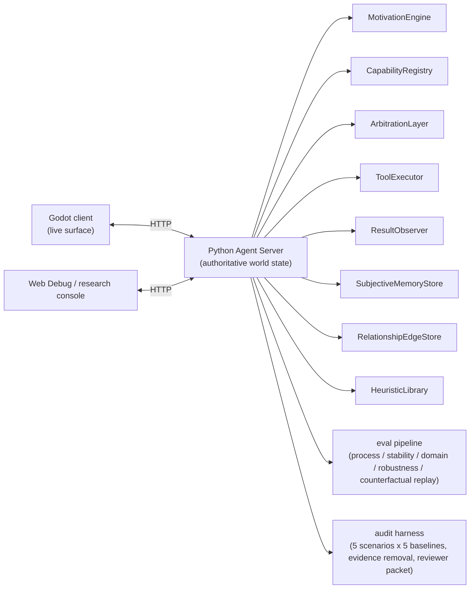

# Loomstead


> **An observability-first multi-agent runtime for tracing, debugging, and auditing autonomous behavior in a simulated town.**

Loomstead uses a playable Godot town as the live surface for complex agent behavior. The engineering stack behind that surface is an authoritative Python agent runtime with structured traces, evidence-linked decisions, eval exports, counterfactual replay, and audit packets — turning opaque agent behavior into inspectable, replayable, auditable artifacts.

## Key Metrics

| Metric | Value |
|---|---|
| Process Fidelity coverage | 4 scenarios × 5 seeds |
| `causal_trace_coverage` | 1.0 |
| `required_process_coverage` | 1.0 |
| `counterfactual_tool_selection_change_rate` | 0.375 |
| Bram decision (full evidence) | `chat_with 0.956874` vs `give_gift 0.902323` |
| `no_relationship_edge` change rate | 0.25 |
| `no_subjective_memory` change rate | 0.0 |
| LLM evidence records | 100 |
| Audit deterministic suite | 5 scenarios × 5 baselines |
| Real provider audit smoke | 5 scenarios × 2 evidence conditions, 10/10 passed |
| Smoke cost / tokens | 0.00351806 USD / 18,348 tokens |
| Assets manifest | 55 items |

## Quick Tour

Read in this order:

1. **Start with the case cards**: [docs/portfolio_case_cards.md](docs/portfolio_case_cards.md) gives three externally readable examples: NPC decision provenance, evidence-removal replay, and high-risk tool audit.
2. **Open the evidence snippets**: [docs/portfolio_evidence_snippets.md](docs/portfolio_evidence_snippets.md) compresses the key promoted artifacts into one short Markdown proof packet.
3. **Map the skills**: [docs/portfolio_capability_map.md](docs/portfolio_capability_map.md) connects runtime / observability / eval / audit assets to interview signals.
4. **Read the short story**: [docs/portfolio_story.md](docs/portfolio_story.md) freezes the Agent Behavior Observatory positioning and honest boundaries.
5. **Use appendices only when needed**: [paper/blog_main.md](paper/blog_main.md), [paper/trace_walkthroughs/figure3_trace_walkthrough_pf_branna_seed01.md](paper/trace_walkthroughs/figure3_trace_walkthrough_pf_branna_seed01.md), and the audit supplement provide deeper evidence.

### What the case cards demonstrate

- **Trace schema design**: Card A shows why `sourceEventIds`, `traceRefs`, `candidateScores`, and score-source links exist — a final action has a navigable path back to evidence, alternatives, and ranking reasons.
- **Evidence-removal replay**: Card B shows observability through controlled before/after artifacts. The replay records when removed evidence changes score, selected tool, or verdict, and when it has no effect.
- **High-risk audit**: Card C shows the shared abstraction with ContextGuard-style evidence-gated execution: required evidence, policy verdict, safe fallback, and counterfactual evidence removal.

### Quick proof points

- Process artifact: 4 scenarios x 5 seeds, aggregate `causal_trace_coverage=1.0`, `required_process_coverage=1.0`, `counterfactual_tool_selection_change_rate=0.375`.
- Bram story: `social.chat_with` wins with full evidence (`0.956874` vs `0.902323`); relationship-edge-only removal keeps the same selected tool; interaction-memory removal flips the replay to `social.give_gift`.
- Audit artifact: real `CloudApiProvider` smoke covers 5 high-risk scenarios x 2 evidence conditions, 10/10 cases passed, cost `0.00351806` USD.

## Three portfolio case cards

### Case A: Why did this NPC choose that action?

Show the runtime path from motivation, memory, relationship evidence, candidate tool scores, and `traceRefs` to the selected NPC action.

**Takeaway**: the system exposes behavior provenance alongside final state.

### Case B: What changed when evidence was removed?

Show counterfactual replay where removing memory, relationship, or evidence links changes scores, selected tools, or verdicts.

**Takeaway**: eval artifacts turn opaque behavior into an evidence-difference story.

### Case C: Why was this high-risk tool call blocked?

Show the audit supplement: full evidence allows a high-risk tool; missing policy evidence routes to a safe review tool.

**Takeaway**: the same trace/evidence language supports operational failure analysis.

## What this project demonstrates

### 1. Agent runtime architecture



The active Phase 2 decision path is:

```text
MotivationEngine -> ToolExecutor -> ResultObserver
```

The runtime includes:

- Director / Event Skill pressure for world-level pacing.
- NPC motivation, capability preferences, and legal tool arbitration.
- Subjective memory and relationship-edge stores.
- Heuristic seeds and later decision influence.
- Authoritative Python Agent Server with Godot as the presentation layer.

### 2. Behavior observability

Loomstead records structured evidence while decisions are made:

- `phase2.trace.v1` for decisions, tool results, interruptions, memory observations, and budget events.
- `sourceEventIds` and `traceRefs` for evidence provenance.
- `candidateScores`, `scoreComponentSourceRefs`, and `scoreExplanationRefs` for arbitration inspection.
- Godot Observer Dock and Web Debug surfaces for local inspection.

The showcase question is simple:

```text
Why did this agent choose this action, and what evidence influenced it?
```

### 3. Eval and artifact pipeline

The project includes a reproducible eval/export stack:

- Process Fidelity checks for evidence-completeness and path-quality guardrails.
- Stability, determinism, domain-adapter, and robustness suites.
- Manifest-backed exports, promoted artifacts, drift notes, and archive checks.
- Coding-domain adapter fixtures with dependency evidence chains.

Current research-grade claims remain intentionally limited. The Process Fidelity evidence supports metric / explainability-level statements only.

### 4. Failure analysis and audit harness

The final rescue spike is retained as an engineering artifact example:

- 5 high-risk non-narrative audit scenarios.
- Full / No Policy Evidence / Evidence Link Removal / Shortcut Agent / Direct Executor baselines.
- Counterfactual evidence removal and audit report generation.
- Real CloudApiProvider audit smoke over 5 scenarios x 2 evidence conditions.
- Reviewer-readable supplement and raw artifacts.

Latest useful audit artifacts:

```text
.run/eval-reviewer-packets/audit_reviewer_packet_2026-06-06T08-58-33Z
.run/eval-reviewer-packets/audit_llm_supplement_2026-06-06T10-59-22Z
```

## Project Status & Scope

- **Status**: feature-complete engineering showcase. The runtime, eval pipeline, and audit harness are stable and reproducible — `npm.cmd run portfolio:verify` checks the evidence chain end to end.
- **Process Fidelity**: the evidence supports metric-level and explainability-level statements. Human-validated believability, enterprise-ready AI safety, and complete causal proof are out of scope.
- **Audit spike**: supports feasibility and failure-analysis storytelling over a bounded scenario set.
- **Visuals**: screenshots and GIFs are optional manual add-ons; the reusable package is the case-card + trace + audit-packet path.

## Local run

Use Windows PowerShell and `npm.cmd`.

```powershell
npm.cmd run context:resume
npm.cmd run context:check
npm.cmd run check
npm.cmd run client:env
npm.cmd run start
npm.cmd run client:run
```

The default Godot scene is:

```text
clients/godot/scenes/world_main.tscn
```

## Useful validation commands

```powershell
npm.cmd run check
npm.cmd run smoke
npm.cmd run eval:process
npm.cmd run eval:domain
npm.cmd run eval:robustness
npm.cmd run eval:audit
npm.cmd run eval:audit:llm-contract:full
npm.cmd run eval:archive:check
npm.cmd run portfolio:snippets
npm.cmd run portfolio:check
npm.cmd run portfolio:verify
git diff --check
```

Real LLM calls require explicit environment authorization and valid local config:

```powershell
npm.cmd run eval:audit:llm-smoke:full
```

## Model configuration

Committed defaults are designed to run without secrets. Local model config and API keys stay in ignored files or environment variables.

- Template: `config/models.example.json`
- Local ignored config: `config/models.json`, `config/models.local.json`
- Check: `npm.cmd run model:check`

## Repository guide

- Current state: [docs/current_status.md](docs/current_status.md)
- Assistant entry: [AGENTS.md](AGENTS.md), [docs/agent_context.md](docs/agent_context.md)
- Portfolio case cards: [docs/portfolio_case_cards.md](docs/portfolio_case_cards.md)
- Portfolio evidence snippets: [docs/portfolio_evidence_snippets.md](docs/portfolio_evidence_snippets.md)
- Portfolio story: [docs/portfolio_story.md](docs/portfolio_story.md)
- Capability map: [docs/portfolio_capability_map.md](docs/portfolio_capability_map.md)
- Technical overview: [paper/blog_main.md](paper/blog_main.md)
- Godot client: [clients/godot/README.md](clients/godot/README.md)

## Development notes

- Backend Runtime owns authoritative world state.
- Godot reads state, submits legal player actions, and presents results.
- LLM output enters visible state through parsing, validation, fallback, and event recording.
- New schemas, trace fields, eval artifacts, or Godot consumer fields start with a data contract.
- Unverified behavior is tracked as pending or manually unverified.
- Secrets, local absolute paths, unregistered assets, and temporary runtime files stay outside committed files.

## License

MIT. See [`LICENSE`](LICENSE).
