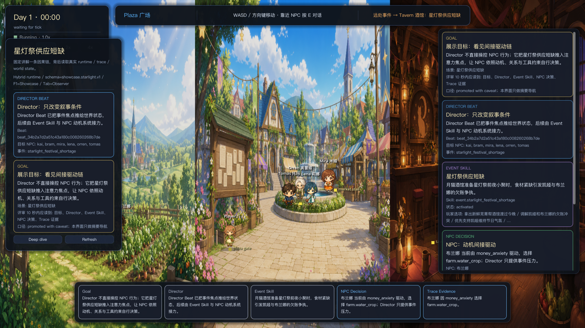
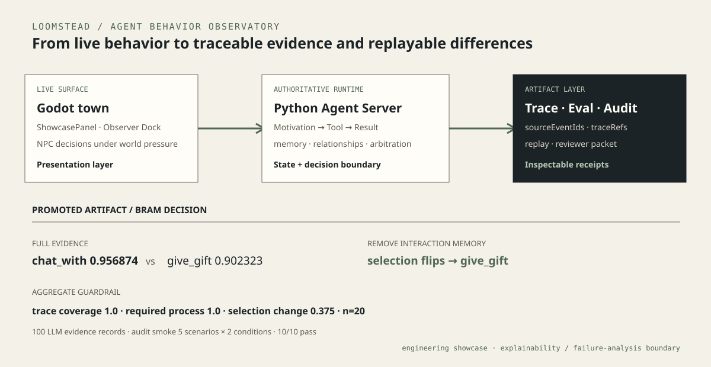
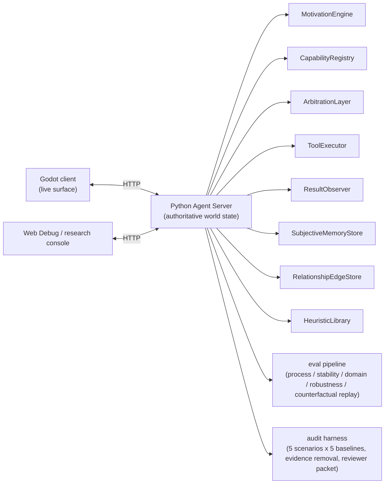

# Loomstead


> **Agent 行为观测台：一个可玩的多 Agent 运行时，每个动作都能回溯到动机、记忆、关系和证据——支持结构化 trace、反事实 replay 与审计 artifact。**
>
> *Agent Behavior Observatory — a playable multi-agent runtime with structured traces, evidence-linked decisions, counterfactual replay, and audit artifacts.*

Godot 小镇是活的行为表面；Python 权威运行时持有世界状态与 Agent 决策，
trace、eval、replay 和 reviewer packet 把这些决策变成可查的工程回执。

*The Godot town is the live behavior surface. An authoritative Python runtime owns
world state and agent decisions; trace, eval, replay, and reviewer packets turn
those decisions into inspectable engineering receipts.*

[打开三张案例卡](docs/portfolio_case_cards.md) ·
[查看 Evidence Snippets](docs/portfolio_evidence_snippets.md) ·
[运行作品集 Gate](#30-second-verification) ·
[查看能力地图](docs/portfolio_capability_map.md)

<p align="center">
  
</p>

<p align="center"><sub>Real Godot runtime · live town and NPC surface · Goal → Director Beat → Event Skill → NPC Decision → Trace Evidence</sub></p>

## 10-second evidence ledger / 10 秒证据台账

| Evidence surface | Receipt |
|---|---:|
| Process suite | 4 scenarios × 5 seeds |
| Trace / required-process coverage | 1.0 / 1.0 |
| Counterfactual selection change | 0.375 over n=20 |
| Real-provider process evidence | 100 records |
| Audit smoke | 5 scenarios × 2 evidence conditions · 10/10 pass |
| Runtime surface | Godot 4.x + Python Agent Server |

## Three questions the project answers

| Reader question | Inspectable artifact |
|---|---|
| Why did this NPC choose that action? | `sourceEventIds`, `traceRefs`, candidate scores, Observer Dock |
| What changed when evidence was removed? | before/after replay, score and selected-tool delta |
| Why was this high-risk call blocked? | required evidence, policy verdict, safe fallback, audit packet |

## Reviewer path

1. Start with the case cards for the readable story.
2. Open the evidence snippets for exact fields and promoted artifact pointers.
3. Use the [trace evidence chain](paper/generated/figures/trace_evidence_chain_figure3.png) or the full walkthrough only for a deeper review.

## Three portfolio case cards

### Case A: Why did this NPC choose that action?

Show the runtime path from motivation, memory, relationship evidence, candidate tool scores, and `traceRefs` to the selected NPC action.

**Takeaway**: the system exposes behavior provenance alongside final state.

### Case B: What changed when evidence was removed?

Show counterfactual replay where removing memory, relationship, or evidence links changes scores, selected tools, or verdicts.

**Takeaway**: eval artifacts turn opaque behavior into an evidence-difference story.

### Case C: Why was this high-risk tool call blocked?

Show the audit supplement: full evidence allows a high-risk tool; missing policy evidence routes to a safe review tool.

**Takeaway**: the same trace/evidence language supports operational failure analysis.

## What this project demonstrates

### 1. Agent runtime architecture

<p align="center">
  
</p>



The active Phase 2 decision path is:

```text
MotivationEngine -> ToolExecutor -> ResultObserver
```

The runtime includes:

- Director / Event Skill pressure for world-level pacing.
- NPC motivation, capability preferences, and legal tool arbitration.
- Subjective memory and relationship-edge stores.
- Heuristic seeds and later decision influence.
- Authoritative Python Agent Server with Godot as the presentation layer.

### 2. Behavior observability

Loomstead records structured evidence while decisions are made:

- `phase2.trace.v1` for decisions, tool results, interruptions, memory observations, and budget events.
- `sourceEventIds` and `traceRefs` for evidence provenance.
- `candidateScores`, `scoreComponentSourceRefs`, and `scoreExplanationRefs` for arbitration inspection.
- Godot Observer Dock and Web Debug surfaces for local inspection.

The showcase question is simple:

```text
Why did this agent choose this action, and what evidence influenced it?
```

### 3. Eval and artifact pipeline

The project includes a reproducible eval/export stack:

- Process Fidelity checks for evidence-completeness and path-quality guardrails.
- Stability, determinism, domain-adapter, and robustness suites.
- Manifest-backed exports, promoted artifacts, drift notes, and archive checks.
- Coding-domain adapter fixtures with dependency evidence chains.

Current evidence covers Process Fidelity, behavior provenance, evidence-removal replay, and bounded audit scenarios.

### 4. Failure analysis and audit harness

The final rescue spike is retained as an engineering artifact example:

- 5 high-risk non-narrative audit scenarios.
- Full / No Policy Evidence / Evidence Link Removal / Shortcut Agent / Direct Executor baselines.
- Counterfactual evidence removal and audit report generation.
- Real CloudApiProvider audit smoke over 5 scenarios x 2 evidence conditions.
- Reviewer-readable supplement and raw artifacts.

Latest useful audit artifacts:

```text
.run/eval-reviewer-packets/audit_reviewer_packet_2026-06-06T08-58-33Z
.run/eval-reviewer-packets/audit_llm_supplement_2026-06-06T10-59-22Z
```

## Project Status & Scope

- **Status**: feature-complete engineering showcase. The runtime, eval pipeline, and audit harness are stable and reproducible — `npm.cmd run portfolio:verify` checks the evidence chain end to end.
- **Evidence coverage**: Process Fidelity, behavior provenance, evidence-removal replay, and bounded audit scenarios are backed by reproducible artifacts.
- **Next validation target**: human-perceived behavior quality and longer-horizon behavior stability.
- **Audit scope**: the bounded scenario set supports feasibility and failure-analysis inspection.

## Local run

Use Windows PowerShell and `npm.cmd`.

```powershell
npm.cmd run context:resume
npm.cmd run context:check
npm.cmd run check
npm.cmd run client:env
npm.cmd run start
npm.cmd run client:run
```

The default Godot scene is:

```text
clients/godot/scenes/world_main.tscn
```

## Useful validation commands

```powershell
npm.cmd run check
npm.cmd run smoke
npm.cmd run eval:process
npm.cmd run eval:domain
npm.cmd run eval:robustness
npm.cmd run eval:audit
npm.cmd run eval:audit:llm-contract:full
npm.cmd run eval:archive:check
npm.cmd run portfolio:snippets
npm.cmd run portfolio:check
npm.cmd run portfolio:verify
git diff --check
```

Real LLM calls require explicit environment authorization and valid local config:

```powershell
npm.cmd run eval:audit:llm-smoke:full
```

## Model configuration

Committed defaults are designed to run without secrets. Local model config and API keys stay in ignored files or environment variables.

- Template: `config/models.example.json`
- Local ignored config: `config/models.json`, `config/models.local.json`
- Check: `npm.cmd run model:check`

## Repository guide

- Current state: [docs/current_status.md](docs/current_status.md)
- Assistant entry: [AGENTS.md](AGENTS.md), [docs/agent_context.md](docs/agent_context.md)
- Portfolio case cards: [docs/portfolio_case_cards.md](docs/portfolio_case_cards.md)
- Portfolio evidence snippets: [docs/portfolio_evidence_snippets.md](docs/portfolio_evidence_snippets.md)
- Portfolio story: [docs/portfolio_story.md](docs/portfolio_story.md)
- Capability map: [docs/portfolio_capability_map.md](docs/portfolio_capability_map.md)
- Technical overview: [paper/blog_main.md](paper/blog_main.md)
- Godot client: [clients/godot/README.md](clients/godot/README.md)

## Development notes

- Backend Runtime owns authoritative world state.
- Godot reads state, submits legal player actions, and presents results.
- LLM output enters visible state through parsing, validation, fallback, and event recording.
- New schemas, trace fields, eval artifacts, or Godot consumer fields start with a data contract.
- Unverified behavior is tracked as pending or manually unverified.
- Secrets, local absolute paths, unregistered assets, and temporary runtime files stay outside committed files.

## License

MIT. See [`LICENSE`](LICENSE).
